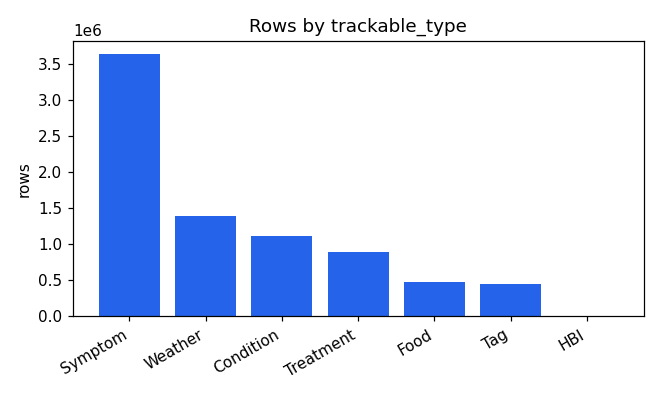
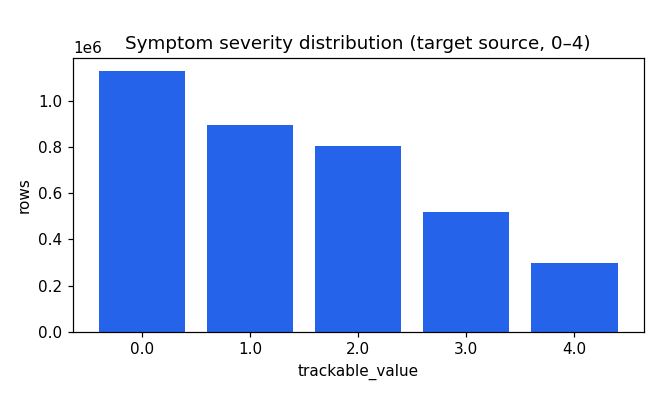
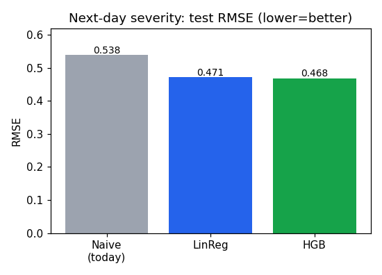
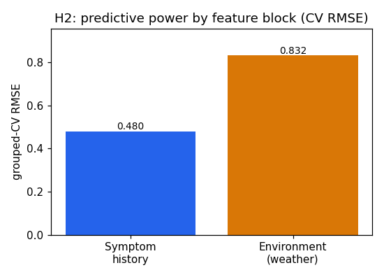
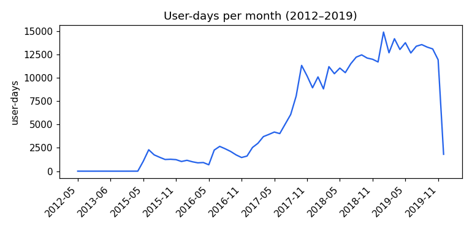

# Data profile: Flaredown export (`export.csv`)

*Generated for the `regression_health` project, predicting next-day symptom severity.*
*Profiler `src/profile_data.py`, chunked full-file pass. Machine-readable copy in `reports/profile_result.json`.*

## Overview

| | |
|---|---|
| Rows | **7,976,223** |
| Users | **42,283** |
| Columns | 9 (1 id, 4 demographic/temporal, 4 trackable fields) |
| Grain | one row per `(user, date, trackable item)`, long / event format |
| Date range | **2012-05-18 → 2019-12-06** (68 active months) |
| Volume | concentrated 2017–2019 (~275k user-days/month by 2019) |
| File size | 686 MB |

This is **not** a modeling table yet, it is an event log. One patient on one day
produces many rows (one per symptom, condition, treatment, food, tag, and six
weather variables). Stage 1 of the pipeline (`build_panel.py`) collapses it to
**383,228 user-days**; stage 2 builds **214,388** next-day prediction pairs.

## Column details

| Column | Class | Null % | Distinct | Notes |
|---|---|---|---|---|
| `user_id` | identifier | 0.0 | 42,283 | hashed; grouping key for CV |
| `age` | metric (dirty) | 3.9 | n/a | **range −196,691 … 2,018** → garbage; median 34 |
| `sex` | dimension | 1.7 | 4 | female 81%, male 7%, other 5%, doesnt_say 5% |
| `country` | dimension | 3.7 | 164 | US 59%, GB 15%, AU 6%, CA 6% |
| `checkin_date` | temporal | 0.0 | 68 months | no future dates; no gaps in monthly coverage post-2016 |
| `trackable_id` | identifier | 0.0 | high | internal id; unused for modeling |
| `trackable_type` | dimension | 0.0 | 7 | Symptom, Weather, Condition, Treatment, Food, Tag, HBI |
| `trackable_name` | text | 0.0 | 8–9k / type | messy free-text |
| `trackable_value` | mixed metric | 11.6 | type-dependent | **meaning depends on `trackable_type`** |

### The target: symptom severity (0–4)
`Symptom` rows (3.64M) carry a clean ordinal severity in `trackable_value`.
Distribution: 0 → 31%, 1 → 25%, 2 → 22%, 3 → 14%, 4 → 8% (mean 1.44, median 1).
Right-skewed toward "no/low symptoms", which matters for stratification and for why
a naive baseline is already fairly strong.

### `trackable_value` is type-dependent, never pool it

| type | rows | value meaning | usable signal |
|---|---|---|---|
| Symptom | 3,642,279 | severity 0–4 | **target** + lagged history |
| Weather | 1,393,806 | one variable per row (temp, humidity, pressure, precip, `icon`) | pivot → wide daily weather |
| Condition | 1,111,517 | condition severity 0–4 (mean 1.70) | daily condition load |
| Treatment | 901,820 | dose, **90% text** ("200mg"); only 91,646 numeric | daily treatment **count** |
| Food | 480,971 | (no value) | daily food count |
| Tag | 445,669 | (no value) | daily tag count |
| HBI | 161 | Harvey-Bradshaw Index 0–20 | negligible |

Top conditions: Fibromyalgia, Depression, Anxiety, Chronic fatigue, Migraine.
Top symptoms: Fatigue, Headache, Nausea, Joint pain, Brain fog.

## Data quality issues

| Severity | Issue | Evidence | Fix applied |
|---|---|---|---|
| 🔴 High | `age` impossible values | min −196,691, max 2,018; 469 rows outside [0,120]; 4,001 rows ≤ 1 | clip to [5,120], else null |
| 🔴 High | `trackable_value` mixed meaning | range pooled across types is meaningless (e.g. Weather min −47 … max 1,051) | split by `trackable_type`; never aggregate across |
| 🟠 Med | Weather stored long | 232,301 rows each for humidity/pressure/temp_max/temp_min/precip/`icon` | pivot to one weather block per user-day |
| 🟠 Med | `trackable_value` 11.6% null | all Tag + Food rows, some Treatment | expected; use counts not values |
| 🟡 Low | `trackable_name` free-text | "Vitamin D3" vs "Vitamin d"; 8–9k distinct/type | standardize (lower/strip) before name-level use |
| 🟡 Low | Demographic nulls | age 3.9%, sex 1.7%, country 3.7% | median/explicit-missing imputation, **fit on train only** |
| 🟢 OK | Dates | 0 nulls, 0 future dates, contiguous monthly coverage | none |
| 🟢 OK | Duplicates | exact `(user,date,trackable_id)` repeats rare in sampled window | de-dup keep-first as a guard |

## Relationships & structure
- **Foreign key / group:** `user_id` links every row and is the natural CV group.
- **Hierarchy:** `user_id` → `checkin_date` → `trackable_type` → `trackable_name`.
- **Time series per user**, sparse and irregular (users skip days) → temporal split
  and a strictly-next-calendar-day target are the honest choices.

## Recommended dimensions, metrics & target

- **Target:** next-day mean symptom severity (0–4), regression.
- **Best metric features:** today's severity + lag1/2/3 + 3-day rolling mean
  (symptom momentum), daily treatment/food/tag counts, condition load, weather
  (temp max/min, humidity, pressure, precip).
- **Best dimensions for slicing:** `sex`, `country`, top `Condition` (Fibromyalgia,
  Depression, Anxiety), day-of-week.
- **Group key:** `user_id`. **Time key:** `checkin_date`.

## Follow-up analyses run in this build
1. **H1, beat the naive baseline.** Linear regression test RMSE **0.471** against
   naive "tomorrow = today" **0.538**, so **12.4% better, H1 supported.** HGB 0.468.
2. **H2, history vs environment.** Grouped-CV RMSE, symptom history **0.48** against
   weather-only **0.83**, so **H2 supported**, history dominates.
3. Temporal hold-out: train 2015–2018 (128,555 rows / 9,252 users), test 2019
   (85,833 rows / 5,212 users).

## Suggested next steps
- Stratify the split on binned severity to balance the skewed target.
- Standardize `trackable_name` and engineer per-condition cohorts (e.g. model
  Fibromyalgia patients separately).
- Add per-user baseline severity as a feature (de-meaned target) to separate
  "who is sicker" from "who is flaring".
- Try sequence models (the data is genuinely temporal) once the tabular baseline
  is locked.
